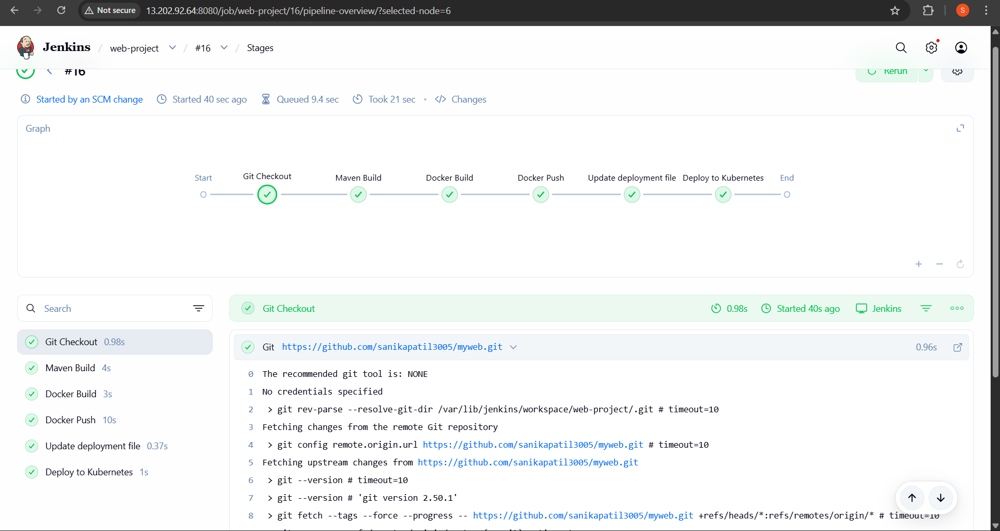
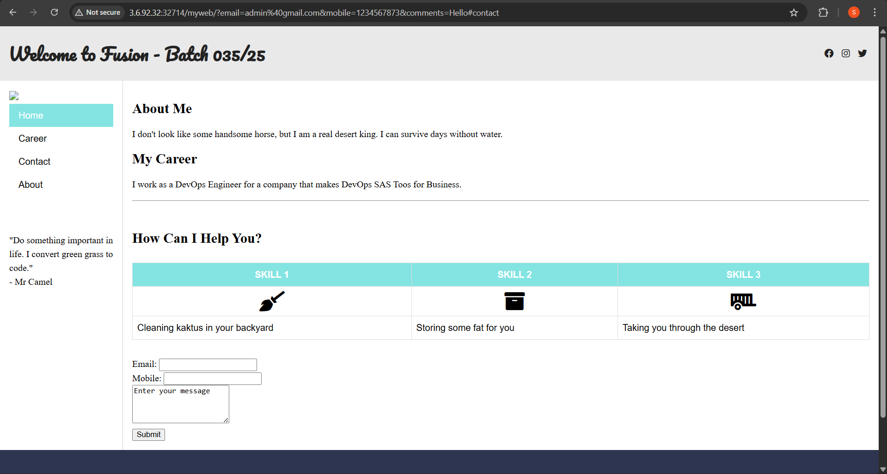
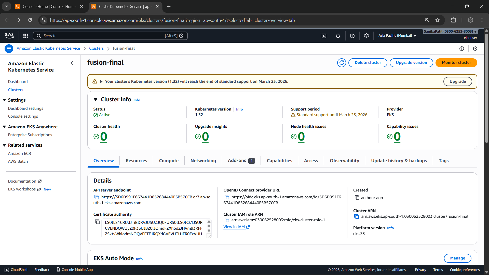
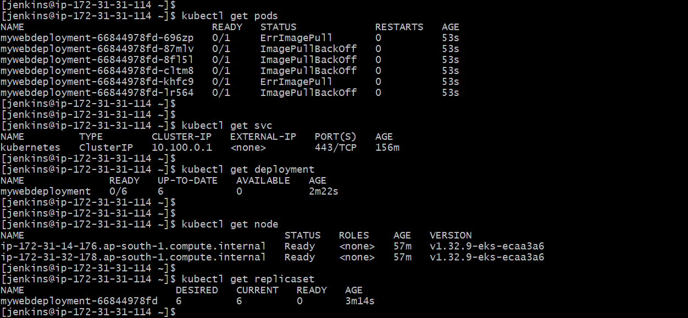
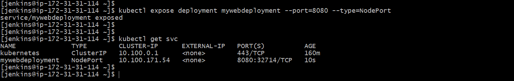

# DevOps CI/CD Automation using Jenkins & Amazon EKS

## Project Overview
This project demonstrates a complete DevOps CI/CD workflow for deploying a Java-based web application on AWS using Jenkins, Docker, and Kubernetes (Amazon EKS).

The primary focus of this project is **CI/CD automation and cloud deployment**, not application development.

---

## Tools & Technologies
- AWS EC2, IAM, EKS
- Jenkins (CI/CD Pipeline)
- Docker & Docker Hub
- Kubernetes
- Maven & Java

---

## CI/CD Workflow
1. Source code fetched from GitHub
2. Application built using Maven
3. Docker image created and pushed to Docker Hub
4. Kubernetes deployment applied on Amazon EKS
5. Poll SCM enabled for automatic builds on code changes

---

## Proof of Execution

### Jenkins Pipeline – Successful Build & Deployment

---

### Application Output (Deployed on EKS)

---

### Amazon EKS Cluster Status

---

### Kubernetes Pods Running

---

### Kubernetes Services (NodePort)

---

## Note
Application source code is not included in this repository as the focus of this project is on **DevOps CI/CD automation, containerization, and cloud deployment**, rather than application development.

---

## Author
**Sanika Kumar Patil**
